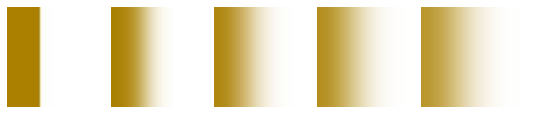
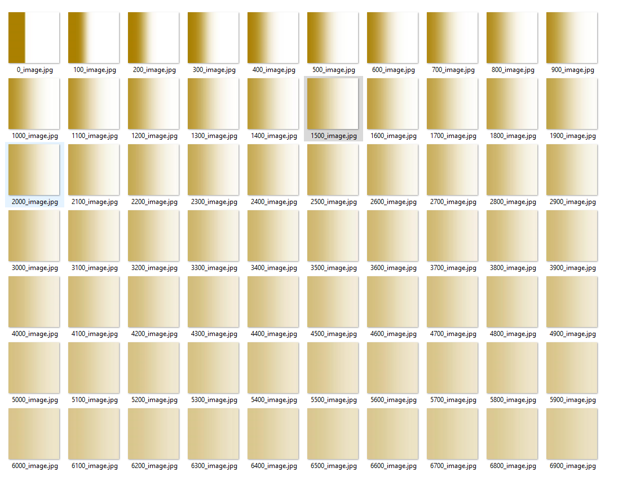
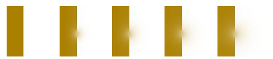
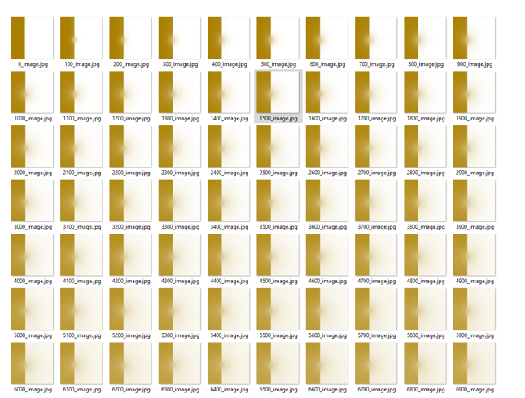
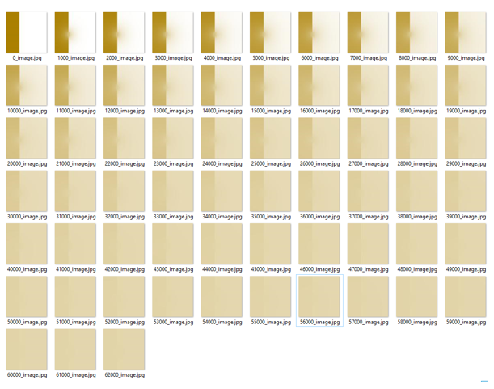

# Opis modelu i realizacji
Program składa się z dwóch klas: Cell.java oraz Main.java. Klasa Main.java zawiera realizację kolejnych punktów instrukcji, zawartych we wskazówkach do zadania:
```java
// ======= directions ==========
    // 1 up, 2 right, 3 down, 4 left
    public float[] fIn;
    public float[] fOut;
    public float[] fEq;
    public float c;
    private final float weight; // used for counting f_eq
    private final float tau; // used for counting f_out
```
Każda komórka zawiera trzy tablice: przechowują one cztery wartości, czyli wartości strumieni w każdym z kierunków (rozpatrujemy cztery kierunki). Nazwa każdej z tablic sugeruje wartości, dla jakiego strumienia są przechowywane.
Poza tymi tablicami znajduje się zmienna odpowiedzialna za stężenie gazu (płynu) w komórce.
Znajdują się także ustalone na wejściu (w przeciwieństwie do pozostałych pól klasy nie ulegają zmianie podczas działania programu) wartości wag dla kierunków (dla każdego 0.25, potem jest to inicjalizowane) oraz tau. Dla bezpieczeństwa dodałem słowo kluczowe final.
```java
    public Cell() {
        fIn = new float[4];
        fEq = new float[4];
        fOut = new float[4];
        for (int i = 0; i < 4; i++) {
            fIn[i] = 0.0f;
            fEq[i] = 0.0f;
            fOut[i] = 0.0f;
        }

        weight = 0.25f;
        tau = 1.0f;
    }
```
Podczas tworzenia każdej z komórek, nadawane są wartości stałym (wagi i tau) oraz zerowane są tablice, przechowujące wartości strumieni.
Pierwsza z metod publicznych oblicza rozkład równowagowy zgodnie ze wzorem:  
$`f_i^{eq} = w_iC`$  
Implementacja wygląda następująco. Jest to po prostu pętla iterująca po wszystkich kierunkach i mnożąca wartość stężenia przez wagę (zawsze 0.25).
```java
    public void countFEq() {
        for (int i = 0; i < 4; i++) {
                fEq[i] = weight * c;
        }
    }
```
Druga z funkcji służy do obliczenia strumienia wyjściowego. Zastosowałem wzór:  
$`f_i^{out} = f_i^{in} + {\Delta \over \tau} [f_i^{eq} - f_i^{in}]`$  
Przy czym w programie założyłem tau równe 1. W związku z tym wzór się upraszcza. Strumień wyjściowy jest tak naprawdę strumieniem równowagowym.
Kod funkcji jest niemal taki sam jak powyższej, jedynie różni się wzorem dla każdej z iteracji.
```java
    public void countFOut() {
        for (int i = 0; i < 4; i++) {
                fOut[i] = fIn[i] + 1.0f / tau * (fEq[i] - fIn[i]);
        }
    }
```
Ostatnia oblicza strumień wejściowy. Jako argument dostaje tablicę wartości strumieni wyjściowych od sąsiadów:  
$`f_i^{in}(r,t + \Delta t) = f_i^{out} (r - c_i, t)`$   
Uwaga: w sytuacji, gdy sąsiad to ściana, wartość ta to -1.0. W takiej sytuacji do strumienia wejściowego przypisuję wartość strumienia wyjściowego z tej komórki (gdy ściana jest po prawej, to z prawej strony komórka tyle dostanie, ile by chciała wypuścić w prawo) zgodnie ze wzorem:  
$`f_i^{in}(r,t + \Delta t) = f_i^{out} (r, t)`$   
Implementacja uwzględnia dodatkowo obliczenie nowego stężenia, czyli sumy wartości strumienia wejściowego dla każdego z czterech kierunków. W szczególności, gdy komórka ma za sąsiada ściankę, jest dodawany odpowiedni strumień wyjściowy.
```java
    public void countFIn(float[] neighbourFOut) {
        float sum = 0.0f;

        for (int i = 0; i < 4; i++) {
            if (neighbourFOut[i] == -1.0f) {
                fIn[i] = this.fOut[i];
            } else {
                fIn[i] = neighbourFOut[i];
            }
            sum += fIn[i];
        }
        this.c = sum;
    }
```
Poza tymi metodami, w klasie znajdują się gettery i setery.
Symulację realizuje klasa Main. Na początku znajduje się nadawanie warunków początkowych i tworzenie potrzebnych obiektów.
Najpierw wykonuję __streaming__. Wywołuję w tym celu dwie metody klasy Cell, które rozkład równowagowy i wyjściowy. Stężenia oblicza wywoływana później metoda, dla pierwszej warunki stężenie brane jest z warunków początkowych.
```java
            // streaming
            for (int i = 0; i < height; i++) {
                for (int j = 0; j < width; j++) {
                    float[] neighbours = new float[4];
                    if (i == 0 || (i == 34 && (j < 50 || j > 60))) { // left
                        neighbours[3] = -1.0f;
                    } else {
                        neighbours[3] = space[i-1][j].getfOut()[1];
                    }
                    if (i == height - 1 || (i == 33 && (j < 50 || j > 60))) { // right
                        neighbours[1] = -1.0f;
                    } else {
                        neighbours[1] = space[i+1][j].getfOut()[3];
                    }
                    if (j == 0) { // top
                        neighbours[0] = -1.0f;
                    } else {
                        neighbours[0] = space[i][j-1].getfOut()[2];
                    }
                    if (j == width - 1) { // bottom
                        neighbours[2] = -1.0f;
                    } else {
                        neighbours[2] = space[i][j+1].getfOut()[0];
                    }
                    space[i][j].countFIn(neighbours);
                }
            }
```
Po tym następuje __kolizja__. Patrzę na sąsiadów komórki i pobieram od nich odpowiednie strumienie wyjściowe. Zwracam uwagę tez na to, czy komórka nie ma za sąsiada ścianki. Jeśli tak, to następuje odbicie od niej – przypisuję wartość -1.0, która jest potem odpowiednio interpretowana. Rozbudowany warunek w instrukcji warunkowej jest spowodowany ścianką.
```java
            // collision
            for (int i = 0; i < width; i++) {
                for (int j = 0; j < height; j++) {
                    space[j][i].countFEq();
                    space[j][i].countFOut();
                }
            }
```
Na koniec drukuję obraz, zapisuję go do pliku.
```java
            // print
            if (it % 1000 == 0) {
                for (int x = 0; x < width; x++) {
                    for (int y = 0; y < height; y++) {
                        img.setRGB(y, x, (new Color(
                                1.0f - space[y][x].getC()/3,
                                1.0f - space[y][x].getC()/2,
                                1.0f - space[y][x].getC()))
                                .getRGB());
                    }
                }
                File outputfile = new File(it + "_image.jpg");
                ImageIO.write(img, "jpg", outputfile);
            }
```

# Wyniki modelowania
Początkowo symulacje uruchomiłem dla obszaru bez ścianki.  
  
Ciekawie widać różnicę na zrzucie ekranu z wieloma zdjęciami (numer oznacza numer iteracji).  
  
Symulacja była prowadzona mniej więcej do osiągnięcia równowagi.  
Druga symulacja była na obszarze ze ścianką.  
  
Zrzut ekranu:  
  
Symulacja nie doprowadziła do równowagi w tej samej ilości iteracji, widać, że przez ściankę utrudnione jest mieszanie. Dlatego tez powtórzyłem to wszystko do osiągnięcia równowagi. Wydruki robione rzadziej.  
  
Stworzyłem na podstawie klatek zdjęć dwa filmiki pokazujące dyfuzję:
- Obszaru bez ścianki: https://photos.app.goo.gl/yEnRLDcmYQAUeF8u7
- Obszaru ze ścianką: https://photos.app.goo.gl/w6vKTiXu4MzWB16k8
